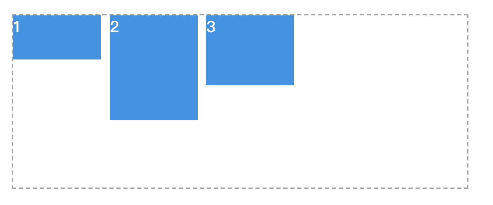
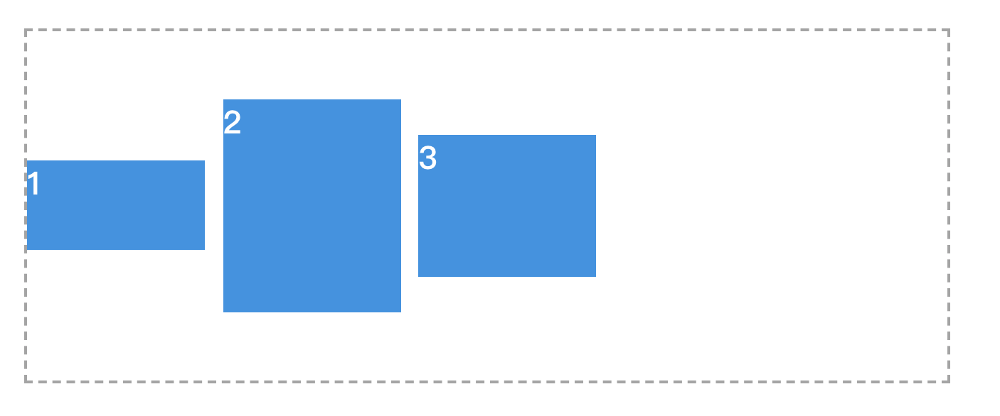
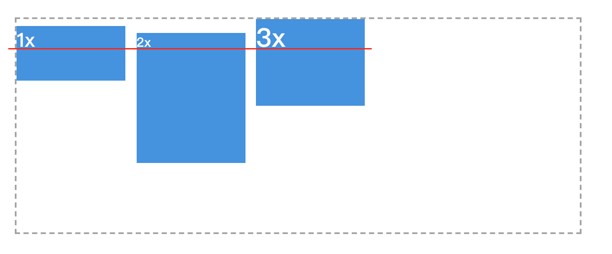
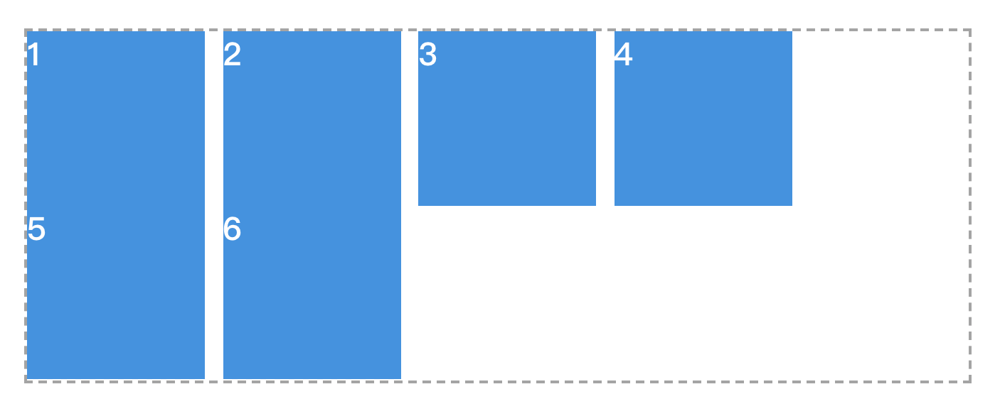
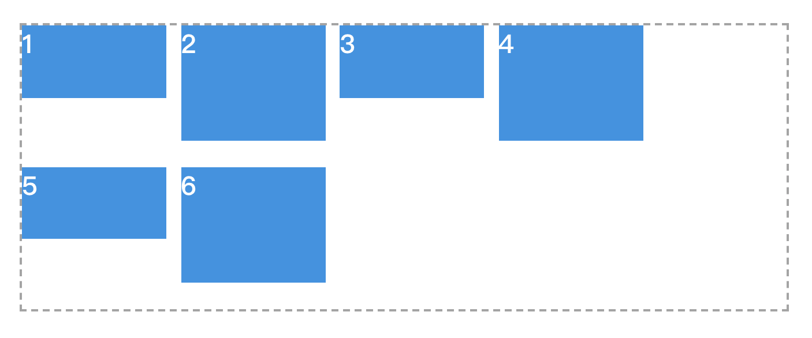
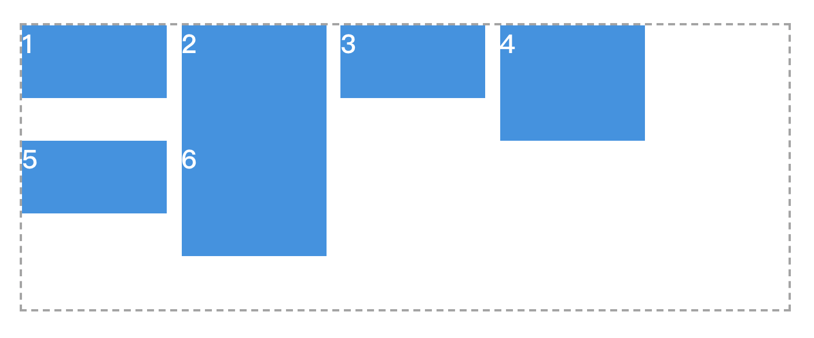
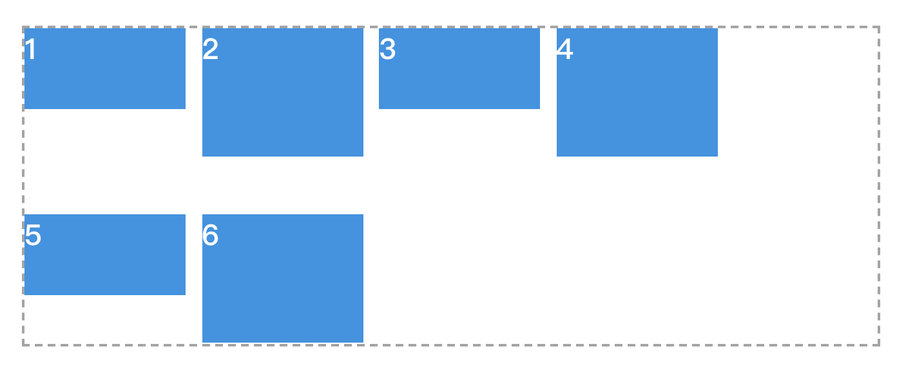
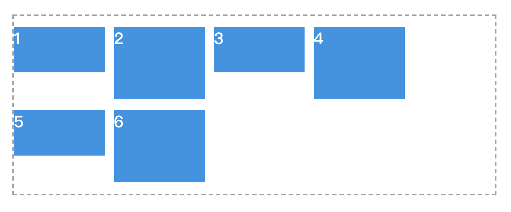

# Flex 布局

### 一、认识 Flex 布局

在 Flex 之前，CSS 布局一般采用正常流、浮动、定位等方式进行页面布局，但是这些传统的布局方式在某些方面有一定局限性，比如使容器中的子项占有相同的宽高、在容器中垂直居中一个子项等等。Flex 布局有以下几个特点：

- **与方向无关**
- **容器空间自动分配、子项自动对齐**
- **一维布局模型**，一次只能处理一行或一列

基于这些特点，使用 Flex 布局会使布局任务变得更加容易。元素要使用 Flex 布局，可以通过 `display` 属性设置

```css
.container {
  display: flex; /* 元素的行为类似于块元素，并根据 flexbox 模型布局其内容 */
}

.container {
  display: inline-flex; /* 元素的行为类似于内联元素，并根据 flexbox 模型布局其内容 */
}
```

注意，设为 Flex 布局后，子项的 `float`、`clear`、`vertical-align` 属性将失效

### 二、Flex 布局模型

采用 Flex 布局的元素，称为 **flex 容器（flex container）**，flex 容器中的所有子元素被称为 **flex 项（flex item）**。flex 容器沿着两个轴来布局：


**主轴**（main axis）是沿着 flex item 放置方向延伸的轴，在页面中默认情况下从左到右的方向；主轴的开始位置称为 main start，结束位置称为 main end，主轴的尺寸由 main size 表示

**交叉轴**（cross axis）是垂直 flex item 放置方向的轴，在页面中默认情况下是从上到下的方向；交叉轴的开始位置称为 cross start，结束位置称为 cross end，交叉轴尺寸由 cross size 表示

而与 Flex 布局相关的 CSS 属性分为两个部分，一部分作用在 flex container，一部分作用在 flex item

### 三、flex container 属性 

作用于 flex container 的 CSS 属性一共有六个，分别是 `flex-direction`、`flex-wrap`、`flex-flow`、`justify-content`、`align-items`、`align-content`

- **`flex-direction`** 定义了 flex container 主轴的方向，从而指定了 flex item 是如何在 flex container 中布局的，语法如下：

  ```
  flex-direction: row | row-reverse | column | column-reverse
  ```

  - **`row`**：默认值，主轴显示为行，方向为当前文本方向。默认文本方向是 `ltr`，表示主轴是从左到右的水平方向；如果文本方向是 `rtl`，表示主轴是从右到左的水平方向

    

  - **`row-reverse`**：主轴显示为行，但方向和 `row` 属性值是相反的

    

  - **`column`**：主轴显示为列，方向默认是从上到下

    

  - **`column-reverse`**：主轴显示为列，但方向和 `column` 属性值是相反的

    

- **`flex-wrap`** 定义 flex item 是单行显示还是换行显示，语法如下：

  ```
  flex-wrap: nowrap | wrap | wrap-reverse
  ```

  - **`nowrap`**：默认值，flex item 单行显示，不换行，可能会导致 flex item 溢出。这需要对 CSS 宽度有一定认识，具体表现如下：

    - 如果 flex item 最小内容宽度（`min-content`）之和大于 flex container 宽度，则 flex item 会溢出

      

    - 如果 flex item 最小内容宽度（`min-content`）之和小于 flex container 宽度，有以下表现：

      - flex item 默认的 `fit-content` 宽度之和大于 flex container 宽度，则 flex item 宽度收缩填满容器，内容不溢出

        

      - flex item 默认的 `fit-content` 宽度之和小于 flex container 宽度，则 flexitem 以`fit-content`宽度正常显示，内容不溢出

        

  - **`wrap`**：flex item 在容器宽度不足时换行，第一行在上面

    

  - **`wrap-reverse`**：flex item 在容器宽度不足时换行，第一行在下面

    

- **`flex-flow`** 是 `flex-direction` 属性和 `flex-wrap` 属性的简写，语法如下：

  ```
  flex-flow: <'flex-direction'> || <'flex-wrap'>
  ```

- **`justify-content`** 定义了 flex item 在主轴上的对齐和分布方式，语法如下

  ```
  justify-content: normal | flex-start | flex-end | center | space-between | space-around | space-evenly
  ```

  - `normal` 是初始值，在 flex 布局中和 `flex-start` 属性值的效果一样

  - **`flex-start`**：flex item 在主轴方向上左对齐。每行的第一个 flex item 从主轴起点开始，后续的 flex item 紧挨前一个对齐

    

  - **`flex-end`**：flex item 在主轴方向上右对齐。每行的最后一个 flex item 从主轴终点开始，其它的 flex item 与后一个对齐

    

  - **`center`**：flex item 表现为居中对齐

    

  - **`space-between`**：flex item 均匀分布在主轴方向上，表现为两端对齐。flex item 之间的间距相等，每行的第一个 flex item 与主轴起点对齐，最后一个 flex item 与主轴终点对齐

    

  - **`space-around`**：flex item 均匀分布在主轴方向上。flex item 之间的间距相等，但是每行第一个 flex item 与主轴起点有间距，每行最后一个 flex item 与主轴终点之间也有间距，它们间距宽度是 flex item 之间间距的一半

    

  - **`space-evenly`**：flex item 均匀分布在主轴方向上。flex item 之间的间距、每行第一个 flex item 到主轴起点之间的间距、每行最后一个 flex item 到主轴终点之间的间距都相等

    

- **`align-items`** 定义了 flex item 在交叉轴上的对齐方式，语法如下：

  ```
  align-items: normal | stretch | flex-start | flex-end | center | baseline
  ```

  - `normal` 是初始值，在 flex 布局中和 `stretch` 属性值的效果一样

  - **`stretch`**： 如果 flex item 未设置高度，则将 flex item 拉伸到 flex container 在交叉轴上的尺寸；如果 flex item 设置了高度，则按照设置的高度值渲染，而非拉伸

    - flex item 未设置高度

      

    - flex item 设置了高度

      

  - **`flex-start`**：flex item 沿着交叉轴起点对齐

    

  - **`flex-end`**：flex item 沿着交叉轴终点对齐

    

  - **`center`**：flex item 在交叉轴上居中对齐

    

  - **`baseline`**：flex item 都相对于 flex container 的基线对齐

    

- **`align-content`** 定义 flex item 有多行的情况下在交叉轴上的对齐方式。如果 flex item 只有一行，则 `align-content` 是没有任何效果的。语法如下：

  ```
  align-content: normal | stretch | flex-start | flex-end | center | space-between | space-around | space-evenly
  ```

  - `normal` 是初始值，在 flex 布局中和 `stretch` 属性值的效果一样

  - **`stretch`**：如果 flex item 未设置高度，则每一行的 flex item 都等比拉伸；比如，如果共两行 flex item，则每一行拉伸高度是50%。如果 flex item 设置了高度，则按照设置的高度值渲染，而非拉伸

    - flex item 未设置高度

      

    - flex item 设置了高度

      

  - **`flex-start`**：第一行的 flex item 沿着交叉轴起点对齐，后面行的 flex item 紧接着上一行对齐

    

  - **`flex-end`**：最后一行的 flex item 沿着交叉轴终点对齐，其它行的 flex item 与前一行对齐

    

  - **`center`**：所有行的 flex item 在交叉轴上居中对齐，每行 flex item 互相紧挨着

    

  - **`space-between`**：所有行的 flex item 都在交叉轴上均匀分布，每行之间的间距相等，第一行的 flex item 沿着交叉轴起点对齐，最后一行的 flex item 沿着交叉轴终点对齐

    

  - **`space-around`**：所有行的 flex item 都在交叉轴上均匀分布，每行之间的间距相等，第一行到交叉轴起点距离和最后一行到交叉轴终点的距离都等于每行之间间距的一半

    

  - **`space-evenly`**：所有行的 flex item 都在交叉轴上均匀分布，第一行到交叉轴起点的距离、最后一行到交叉轴终点的距离、每行之间的间距都相等

    