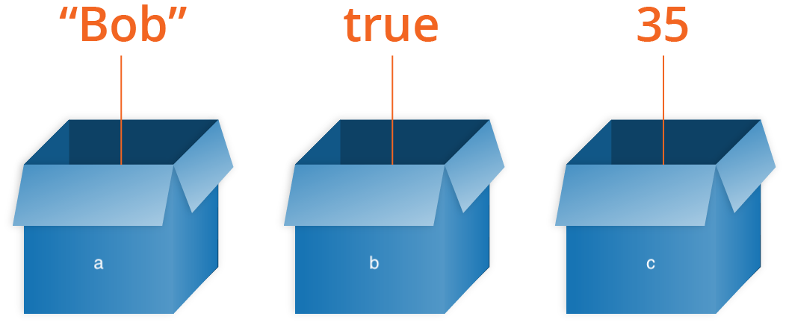

# 变量

### 认识变量

在 JavaScript 中，变量是指**用来存储任意值的命名占位符，变量不是值本身，它仅仅是一个用于存储任意值的容器**。比如，可以把变量想象成一个个装东西的箱子：



在上图中，变量作为了存储字符串、布尔值、数值的“箱子”，如下代码：

```javascript
var a = 'Bob';
var b = true;
var c = 35;
```

同时，JavaScript 中的变量具有**松散类型**的特点，变量的值和值的数据类型在脚本的生命周期内都可以改变（合法，但不推荐）：

```javascript
var a = 10;
a = 25; // 变量 a 的值从数值 10 改变为数值 25
a = { name: 'xxx' }; // 变量 a 的数据类型从 Number 改变为 Object
```

### 声明变量

要想使用变量，第一步要做的就是创建它——更准确地说，是声明一个变量。在 JavaScript 中，**声明变量的方式有三种：分别是使用 `var`、`let`、`const` 后接变量名的方式**。其中，变量名作为标识符，其命名规则如下：

- 第一个字符必须是字母、下划线（_）或美元符号（$）。
- 剩下的其它字符可以是字母、下划线、美元符号或数字（0-9）。
- 由于 JavaScript 使用的是 Unicode 字符集，所以字母可以是 Unicode 中的字母字符。比如，中文也是合法的变量名
- 关键字、保留字、`true`、`false`、`null` 不能用作变量名。

下面是一些变量名的命名示例：

```javascript
// 合法的变量名
name
age
_this
$attr
临时变量
ơ

// 不合法的变量名
9book // 不能以数字开头
new // 不能使用关键字
enum // 不能使用保留字
null
```

接下来是三种声明变量方式的介绍：

#### var

使用 `var` 关键字可声明一个变量，并可选地


### 2.变量

- 认识变量

  在 JavaScript 中变量是用来保存任意**值**的命名占位符，变量和**值**之间建立了一种引用关系，使用变量，就等于引用了这个值。

  ```javascript
  var fruit = 'apple';
  ```

  上面代码声明先声明了变量 `fruit`，然后在变量 `fruit` 和字符串 `apple` 之间建立了引用关系。在后续使用中，使用变量 `fruit` 就会得到字符串 `apple`。而关键字 `var` 是变量声明命令，它会通知 JavaScript 引擎将要创建一个变量 `fruit`

  同时，JavaScript 作为动态语言，其变量也是**松散类型**的，表示变量可以用来保存任意类型的数据，并且在使用中也可以改变数据类型

  ```javascript
  var a = 'fish';
  a = 1;
  ```

  上面代码中，变量 `a` 先被赋值为一个字符串，后又被赋值为数值

- **声明变量**

  如果直接使用一个未声明的变量，JavaScript 会报错，告诉你该变量未定义，如下代码：

  ```javascript
  a; // Uncaught ReferenceError: a is not defined
  ```

  **在 JavaScript 中声明变量的方式有：使用形如 `variable = 3` 的语法、`var`、`let`、`const`**

  - **`var` 声明一个全局或局部变量，可选是否初始化一个值（未初始化则保存特殊值 `undefined`）**

    - 使用方式：`var` 后跟变量名；声明多个变量，在一条语句中使用逗号分隔。如果选择初始化值则等于进行了变量的声明和赋值这两个操作

      ```javascript
      var a; // 未初始化，变量 a 的值为 undefined
      
      var b = 'test'; // 有初始化，b 被定义为一个保存字符串值 test 的变量
      // 上面语句等同于
      var b; // 声明变量
      b = 'test'; // 变量赋值
      
      var c = 2, d = 'test', e; //声明多个变量
      var f = 10,
          g,
          h = 'test'; // 声明多个变量，缩进和换行不是必需的，只是有利于阅读
      ```

    - **变量名可重复声明**。如果后续只是声明相同的变量名，那么该变量的值不变；如果后续声明相同的变量名并赋值，那么会覆盖掉前面的值

      ```javascript
      // 只声明相同的变量名不赋值
      var a = 100;
      var a;
      console.log(a); // 100
      
      // 声明相同的变量名并赋值，变量 b 的值为改变后的值
      var b = ‘test’;
      var b = 20;
      console.log(b); // 20
      ```

    - **作用域**

      - 全局作用域：`var` 在**函数外部**声明变量的作用域是全局环境，该变量叫全局变量。同时，全局变量会成为全局对象的属性。比如在浏览器中，全局对象是 `window`，可以用形如 `window.variable` 的语法来设置和访问全局变量

        ```javascript
        var a = 1; //全局变量
        if (true) {
          console.log(a); // 1
        }
        function fn() {
          console.log(a);
        }
        window.a = 3; // 浏览器环境下，全局对象是 window
        console.log(window.a); // 3
        fn(); // 3
        ```

      - 局部作用域，`var` 在**函数内部**声明变量是局部变量，该变量的作用域只在当前函数内部，表示该变量只能在当前函数内部访问

        ```javascript
        function fn() {
          var a = 1; // 局部变量
          console.log(a); // 1
        }
        fn();
        console.log(a); // 报错 Uncaught ReferenceError: a is not defined
        ```

        上面代码中，变量 `a` 定义在 `fn` 函数内部。当调用 `fn` 函数时会创建变量 `a` 并赋值；调用完后变量 `a` 随即被销毁，所以在函数外部访问变量 `a` 时显示它未定义的报错

  - **`let` 声明一个拥有块作用域的变量，可选是否初始化一个值（未初始化则保存特殊值 `undefined`）**

    - 使用方式：

- **变量类型**

- **变量提升**

