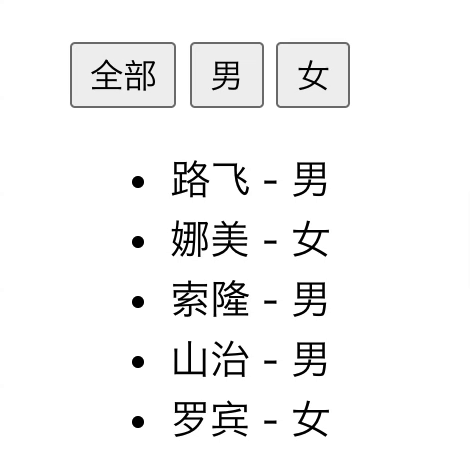
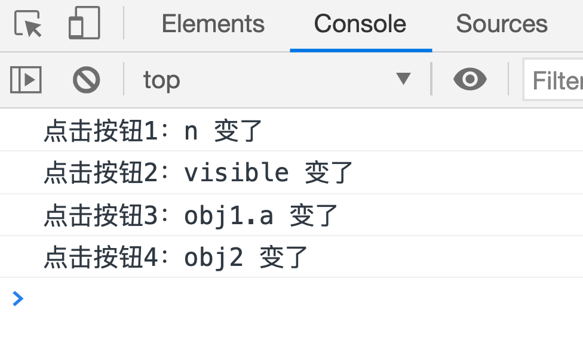
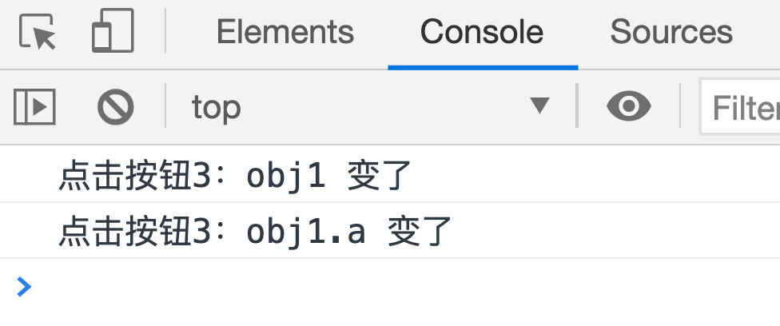
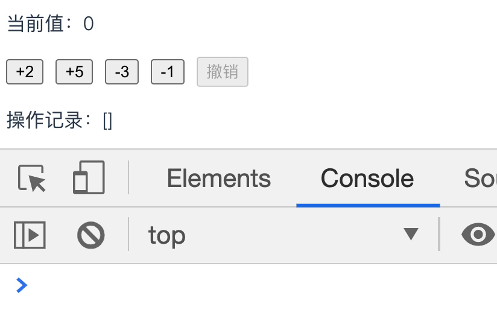
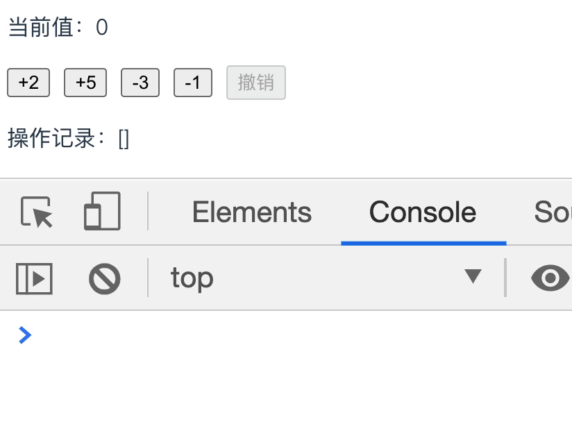

# 计算属性和侦听器

### computed

**`computed` 是计算属性，它会基于所依赖的响应式 property 动态显示最新的计算结果；计算属性的结果会被缓存，只有其依赖的响应式 property 有变化才会重新计算**。尽管计算属性的写法在形式上是方法，但它最终会被混入到 Vue 实例中当作 property 使用，所有 getter 和 setter 的 this 上下文自动地绑定为 Vue 实例，用法示例如下：

```javascript
const vm = new Vue({
  data: {
    n: 1
  },
  computed: {
    // 用法一：仅读取，计算属性的 getter
    nDouble () {
      // this 指向当前实例 vm
      return this.n * 2
    },
    // 用法二：读取和设置，计算属性的 getter 和 setter
    nPlus: {
      // getter
      get () {
        return this.n + 1
      },
      // setter
      set (value) {
        // this 指向当前实例 vm
        this.n = value - 1
      }
    }
  }
})
console.log(vm.nDouble) // 2
vm.nPlus = 5 
console.log(vm.n) // n => 4
console.log(vm.nPlus) // 5
console.log(vm.nDouble) // 8
```

`computed` 常用的使用场景——要使用的属性会受到数据对象中某些 property 的变化的影响：

#### 展示用户信息

页面某个地方需要按照昵称、手机、邮件的顺序展示用户信息，如果昵称不存在就展示手机；如果昵称和手机都不存在就展示邮件。同时，有很多地方都需要像这样展示用户信息：

```vue
<template>
  <!-- 很多地方都需要这样展示用户信息 -->
  <p>用户信息：{{ user.nickname || user.phone || user.email }}</p>
</template>

<script>
export default {
  data () {
    return {
      user: {
        nickname: '路飞',
        phone: '13389896666',
        email: 'lufei@qq.com'
      } 
    }
  }
}
</script>
```

通过上面代码就可以实现按照既定顺序展示用户信息的需求，但是有天如果业务变更，用户信息的展示顺序变为手机、昵称、邮件，那么很多地方都需要修改代码来满足需求变更。这种场景下，可以使用 `computed`：

```html
<template>
  <!-- 使用计算属性展示用户信息 -->
  <p>用户信息：{{ displayUser }}</p>
</template>

<script>
export default {
  // ...
  computed: {
    displayUser () {
      const { user: { phone, nickname, email } } = this
      return phone || nickname || email
    }
  }
}
</script>
```

这里声明了一个计算属性 `displayUser`，可以像使用普通 property 一样在模板中使用该计算属性。在使用它时，Vue 知道计算属性 `displayUser` 依赖于 `user` property，当 `user` property 发生改变时（比如，用户信息改变、用户信息的展示顺序改变），所有在模板中使用计算属性 `displayUser` 的地方都会自动更新。

如果页面还有一个修改手机号的按钮，当点击它时就重新设置用户手机号，可以将上面的计算属性改写为：

```vue
<script>
export default {
  // ...
  computed: {
    displayUser: {
      get () {
        const { user: { phone, nickname, email } } = this
        return phone || nickname || email
      },
      set (value) {
        this.user.phone = value
      } 
    }
  },
  methods: {
    setPhone () {
      this.displayUser = '15133339999'
    }
  }
}
</script>
```

这样在点击修改手机按钮时，计算属性 `displayUser` 的 `setter` 会被调用，进而更新 `user.phone` property 的值。           

#### 根据性别切换用户列表

在页面中有一个展示用户昵称和性别的列表，代码如下：

```vue
<template>
  <div>
    <div>
      <button>全部</button>
      <button>男</button>
      <button>女</button>
    </div>
    <ul>
      <li v-for="user in users" :key="user.id">
        {{ user.nickname }} - {{ user.gender }}
      </li>
    </ul>
  </div>
</template>

<script>
// 创建用户
let id = 0
const createUser = (nickname, gender) => {
  id += 1
  return { id, nickname: nickname, gender: gender }
}

export default {
  data: {
    users: [
      createUser('路飞', '男'),
      createUser('娜美', '女'),
      createUser('索隆', '男'),
      createUser('山治', '男'),
      createUser('罗宾', '女')
    ]
  }
}
</script>
```

效果如下图所示：


要实现的需求是，当点击全部按钮时，展示所有的用户；当点击男按钮时，展示性别为男的用户；当点击女按钮时，展示性别为女的用户。

实现思路，页面用户列表的数据源更改为计算属性 `displayUsers`，它根据 `gender` property 的变化展示不同性别的用户：

```vue
<template>
  <div>
    <div>
      <!-- 给切换按钮添加事件 -->
      <button @click="setGender('all')">全部</button>
      <button @click="setGender('male')">男</button>
      <button @click="setGender('female')">女</button>
    </div>
    <ul>
      <!-- 页面用户列表的数据源改为计算属性 displayUsers -->
      <li v-for="u in displayUsers" :key="u.id">
        {{ u.nickname }} - {{ u.gender }}
      </li>
    </ul>
  </div>
</template>

<script>
// ...
export default {
  data: {
    // ...
    gender: 'all'
  },
  computed: {
    displayUsers () {
      const genderHash = {
        male: '男',
        female: '女'
      }
      const { users, gender } = this
      return gender === 'all' ? users : users.filter(user => user.gender === genderHash[gender])
    }
  },
  methods: {
    setGender (gender) {
      this.gender = gender
    }
  }
}
</script>
```

最终实现效果：



通过上面两个场景示例对计算属性的使用有了更多认识——**计算属性可以让模板更简洁、逻辑更清晰、代码更易于维护**。

#### 计算属性 vs 方法

在根据性别切换用户列表这个场景示例中，也可以使用方法来达到相同效果。实现思路，首先用户列表的数据源 `users` property 不能被修改，所以新增一个 `displayUsers` property，并在 `created` 钩子中将 `users` 赋值给 `displayUsers`，同时添加一个根据性别展示不同用户的方法 `showUsers`：

```vue
<script>
// ...
export default {
  data: {
    // 新增 displayUsers
    displayUsers: []
  },
  created () {
    // 在 created 钩子赋值
    this.displayUsers = this.users
  },
  methods: {
    // 新增 showUsers 方法
    showUsers (gender) {
      const genderHash = {
        male: '男',
        female: '女'
      }
      const { users } = this
      this.displayUsers = gender === 'all' ? users : users.filter(user => user.gender === genderHash[gender])
    },
    setGender (gender) {
      this.showUsers(gender)
    }
  }
}
</script>
```

使用方法和计算属性都能实现需求，但不同的是**计算属性可以基于它们的响应式依赖进行缓存，只有在相关依赖发生改变时才会重新计算；而调用方法则总是会重新执行函数**。

- 通过方法实现时，在 `showUsers` 方法中添加一个 log：

  ```vue
  <script>
  export default {
    methods: {
      showUsers (gender) {
        console.log('showUsers 方法被调用了')
        // ...
      }
    }
  }
  </script>
  ```

  当点击按钮时：

  

  **方法总是会重新执行，没有缓存结果**。无论是点击不同按钮还是连续点击相同按钮，`showUsers` 方法都会被重新调用。

- 通过计算属性实现时，在计算属性 `displayUsers` 中添加一个 log：

  ```vue
  <script>
  export default {
    // ...
    computed: {
      displayUsers () {
        // ...
        console.log(`displayUsers 计算了 ${genderHash[gender]} 一次`)
        // ...
      }
    }
  }
  </script>
  ```
  
  当点击按钮时：
  

  
**计算属性 `displayUsers` 会根据依赖的 `gender` property 进行计算，并且会缓存计算结果**。当点击不同按钮时，`gender` 发生了改变，`displayUsers` 会马上重新求值；当连续点击相同按钮时，`gender` 没有发生改变，`displayUsers` 会立即返回之前的计算结果，而不会重新求值。
  
需要缓存的好处在于，如果有一个场景需要进行大量计算，页面开销性能较大，使用计算属性则可以利用缓存减少页面开销；使用方法会每次都重新计算，可能会影响用户体验。

### watch

**`watch` 是侦听器，可以通过 `watch` 观察数据对象中 property 值的变化进而执行一些操作，`watch` 是一个异步的过程**。`watch` 的用法是一个对象，键是需要观察的表达式，值是对应的回调函数，其中值的表现形式可以是函数、方法名、包含选项的对象、包含回调的数组：

```javascript
new Vue({
  data: {
    a: 1,
    b: 2,
    c: {
      c1: '111',
      c2: '222'
    },
    d: 4,
    e: 5,
    user: {
      nickname: '路飞',
      age: 18
    }
  },
  watch: {
    //第一种，值为函数
    a (newValue, oldValue) {
      console.log(`from: ${oldValue}, to: ${newValue}`)
    },
    // 第二种，值为方法名
    b: 'methodName',
    // 第三种，值为包含选项的对象，选项有：deep 和 immediate，回调函数是 handler
    c: {
      handler (newValue, oldValue) {},
      // deep: true 表示该回调会在被监听的对象 c 的属性改变时被调用，不论属性被嵌套多深
      deep: true
    },
    d: {
      handler: 'methodName',
      // watch 中一开始时 handler 回调并不会执行，只有在 d property 改变时才会调用回调
      // 设置 immediate: true 表示 handler 回调会在一开始就被调用
      immediate: true
    },
    // 第四种，值为一个包含回调数组，它们会被逐一调用
    e: [
      function handler1(newValue, oldValue) {},
      'handler2',
      {
        hanlder (newValue, oldValue) {},
        // 选项
      }
    ],
    // key 还可以是 data 中某个对象中的属性
    'user.nickname' (newValue, oldValue) {}
  }
})
```

值得注意的是，**不应在 `watch` 中使用箭头函数**。

#### 何谓数据变化

`watch` 会在它观察的 property 的值发生变化时作出响应，接下来了解一下 property 值的变化：

```vue
<template>
  <div>
    <button @click="n += 2">按钮1</button>
    <button @click="visible = !visible">按钮2</button>
    <button @click="obj1.a += 'ggg'">按钮3</button>
    <button @click="obj2 = { b: 'bbb' }">按钮4</button>
  </div>
</template>

<script>
export default {
  data () {
    return {
      n: 1,
      visible: false,
      obj1: {
        a: 'aaa'
      },
      obj2: {
        b: 'bbb'
      }
    }
  },
  watch: {
    n () {
      console.log('点击按钮1：n 变了')
    },
    visible () {
      console.log('点击按钮2：visible 变了')
    },
    obj1 () {
      console.log('点击按钮3：obj1 变了')
    },
    'obj1.a' () {
      console.log('点击按钮3：obj1.a 变了')
    },
    obj2 () {
      console.log('点击按钮4：obj2 变了')
    },
    'obj2.b' () {
      console.log('点击按钮4：obj2.b 变了f')
    }
  }
}
</script>
```

点击按钮时会修改数据对象中某些 property 的值，而 `watch` 会在监听到这些 property 值的变化时在控制台打印出相应内容：



对于像 `n`、`visible` 、`obj1.a` 这种属于基本类型的 property，只要它们的值改变，就会被 `watch` 监听。

对于对象这种属于复杂类型的 property，只有当其引用值的地址发生改变才会被 `watch` 监听。点击按钮3执行 `obj1.a += 'ggg'` 时，只有 `obj1.a` 这个基本类型的值变化了，但 `obj1` 的引用值的地址并未改变，所以未被 `watch` 监听。点击按钮4执行 `obj2 = { b: 'bbb' }` 时，尽管 `obj2` 由赋值得到的新对象的键值对和之前一样，但 `obj2` 引用值的地址发生了改变，所以 `obj2` 会被 `watch` 监听。

如果要想在 `obj1.a` 发生改变时也让 `watch` 认为 `obj1` 也改变了，可以使用 `deep: true`：

```vue
//...
<script>
export default {
	// ...
  watch: {
    obj1: {
      handler () {
        console.log('点击按钮3：obj1 变了')
      },
      deep: true
    }
  }
}
</script>
```

点击按钮3时，控制台打印结果如下：



#### watch 是异步的

页面中有一个展示当前值和操作历史的模块，如下图：


当点击不同的加减按钮时，当前值和操作记录都会作相应的改变；点击撤销按钮会把当前值和操作记录恢复到之前的数据，代码如下：

```vue
<template>
  <div class="about">
    <p>当前值：{{ n }}</p>
    <div>
      <button @click="n += 2">+2</button>
      <button @click="n += 5">+5</button>
      <button @click="n -= 3">-3</button>
      <button @click="n -= 1">-1</button>
      <button :disabled="history.length === 0" @click="revoke">撤销</button>
    </div>
    <p>操作记录：{{ history }}</p>
  </div>
</template>

<script>
export default {
  data () {
    return {
      n: 0,
      history: []
    }
  },
  watch: {
    n (newValue, oldValue) {
      this.history.push({ from: oldValue, to: newValue })
    }
  },
  methods: {
    revoke () {
      const lastItem = this.history.pop()
      this.n = lastItem.from
    }
  }
}
</script>
```

在页面中进行加减按钮操作后，再点击撤销按钮，会发现 `history` 并没有恢复到最后一次加减操作前的数据。这是由于 `n` 一直被 `watch` 着，`watch` 会把撤销操作里对 `n` 的赋值当成一个新的操作记录添加到 `history` 中，解决办法是添加一个状态来判断是否处于撤销中：

```vue
<script>
export default {
  data () {
    return {
      // ...
      // 添加一个状态表示是否处于撤销状态，默认是不处于
      inRevokeStatus: false
    }
  },
  watch: {
    n (newValue, oldValue) {
      // 不处于撤销状态才会添加项到操作记录中
      if (!this.inRevokeStatus) {
        this.history.push({ from: oldValue, to: newValue })
      }
    }
  },
  methods: {
    revoke () {
      // 点击撤销按钮后，将 inRevokeStatus 设置为处于撤销状态
      this.inRevokeStatus = true
      const lastItem = this.history.pop()
      this.n = lastItem.from
      // 对 n 赋值后将 inRevokeStatus 设置为不处于撤销状态
      this.inRevokeStatus = false
    }
  }
}
</script>
```

更新上面代码后再次进行之前的操作，会发现 `history` 中还是会有 `n` 在撤销操作中的数据，通过 log 验证点击撤销按钮后处于什么撤销状态：

```vue
<script>
export default {
  // ...
  watch: {
    n (newValue, oldValue) {
      console.log('是否处于撤销状态：', this.inRevokeStatus ? '处于' : '不处于')
      // 不处于撤销状态才会添加项到操作记录中
      if (!this.inRevokeStatus) {
        this.history.push({ from: oldValue, to: newValue })
      }
    }
  },
  // ...
}
</script>
```

控制台中打印出如下内容：



尽管在撤销操作中设置了处于撤销状态，但在 `watch` 中通过 log 可以知道仍然是不处于撤销状态。这是因为 `watch` 是异步的，它会等当前代码执行完了才对 `n` 的变化进行操作，大体流程如下：

```javascript
// 点击撤销按钮，先设置处于撤销状态
this.inRevokeStatus = true
// 对 n 赋值，这个时候 n 变化了，但是 watch 不会立即执行
this.n = lastItem.from
// 设置不处于撤销状态
this.inRevokeStatus = false
// 最后 watch 才执行 n 变化的操作，这样的话永远不处于撤销状态，所以点击撤销按钮 history 中永远都会添加新的操作记录
```

要想解决上述问题，可以使用 `$nextTick`：

```vue
<script>
export default {
  methods: {
    revoke () {
      this.inRevokeStatus = true
      const lastItem = this.history.pop()
      this.n = lastItem.from
      // nextTick 会等 watch n 执行完后才设置不处于撤销状态
      this.$nextTick(() => {
        this.inRevokeStatus = false
      })
    }
  }
}
</script>
```

最终效果如下图：



#### watch vs computed

在展示用户信息的场景示例中，也可以使用 `watch` 实现同样的效果：

```vue
<template>
  <div class="about">
    <p>用户信息：{{ displayUser }}</p>
    <button @click="user.nickname = '索隆'">修改用户名</button>
  </div>
</template>

<script>
export default {
  data () {
    return {
      user: {
        nickname: '路飞',
        phone: '13389896666',
        email: 'lufei@qq.com'
      },
      displayUser: ''
    }
  },
  watch: {
    // watch user 每个 key 的变化
    'user.nickname': {
      handler () {
        const { user: { nickname, phone, email } } = this
        this.displayUser = nickname || phone || email
      },
      // Vue 认为在开始时数据从无到有不是一个变化的过程，所以页面中的 displayUser 为空
      // immediate: true 表示数据从无到有也是变化的过程，页面中 displayUser 会有 nickname || phone || email 表达式的值
      immediate: true
    },
    'user.phone': {
      handler () {
        const { user: { nickname, phone, email } } = this
        this.displayUser = nickname || phone || email
      },
      immediate: true
    },
    'user.email': {
      handler () {
        const { user: { nickname, phone, email } } = this
        this.displayUser = nickname || phone || email
      },
      immediate: true
    }
  }
}
</script>
```

相比较 `computed`，使用 `watch` 实现的代码，代码更多且有重复。在大多数 `computed` 和 `watch` 都能实现的情况下，尽量使用 `computed`，而如果需要在数据变化时进行一些操作，则使用 `watch`。