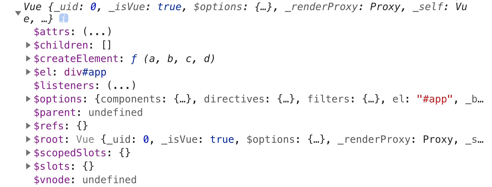

# Vue 实例

### 创建 Vue 实例

每个 Vue 应用都是通过用 `Vue` 函数创建一个新的 Vue 实例开始的：

```javascript
const vm = new Vue({
  // 选项对象
})
```

在创建 Vue 实例时，可以传入一个**选项对象**，它包括：**数据**、**DOM**、**生命周期钩子**、**资源**、**组合**、**其它**这几大类。通过这些选项可以创建我们想要的行为，比如，我们可以使用 `el` 将 Vue 实例挂载到页面的某个元素上：

```javascript
new Vue({
  el: '#app'
})
```

### 实例的属性和方法

创建 Vue 实例后，在控制台打印该实例：



Vue 实例是一个对象，它会暴露出来一些有用的属性和方法——都含有前缀 `$`，以便与开发者定义的 property 区分开来。比如：

```javascript
const data = { n: 0 }
const vm = new Vue({
  el: '#app',
  data: data
})

// $el 属性：实例使用的根 DOM 元素
vm.$el === document.getElementById('app') // true

// $data 属性：Vue 实例观察的数据对象
vm.$data === data // true

// $watch 方法
vm.$watch('n', (newValue, oldValue) => {
  // 这个回调将在 `vm.n` 改变后调用
})
```

### el 选项

`el` 选项会提供一个在页面上已存在的 DOM 元素作为 Vue 实例的挂在目标，它的值可以是：

- CSS 选择器

  ```html
  <div id="app"></div>
  <scipt>
    new Vue({
      el: '#app'
    })
  </scipt>
  ```

- HTMLElement 实例

  ```html
  <div id="app"></div>
  <scipt>
    const appElement = document.getElementById('app')
    new Vue({
      el: appElement
    })
  </scipt>
  ```

在实例挂载后，可以通过 `vm.$el` 访问该元素：

```javascript
console.log(vm.$el) // <div id="app"></div>
```

如果在实例化时 `el` 选项存在，那么实例将立即进入编译过程，否则，需要显式调用 `vm.$mount()` 手动开启编译：

```javascript
new Vue({
  template: '<h1>Vue.js</h1>'
}).$mount('#app')
```

此外，还有两个注意点：

- 提供的元素只能作为挂载点，并且挂载元素会被 Vue 生成的 DOM 替换，所以不推荐将实例挂载到 `<html>` 或 `<body>` 元素上。
- 如果 `template` 和 `render` 这两个属性都不存在，那么挂载元素的 HTML 会被提取出来作为模板。此时，就必须使用完整版构建的 Vue。

### data 选项

`data` 是 Vue 实例的数据对象，有以下两种使用方式：

- 在根实例中，`data` 可以是一个对象，也可以是一个函数：

  ```javascript
  // 根实例中
  new Vue({
    el: '#app',
    // 对象写法
    data: {
      total: 0,
      data: []
    }
    // 函数写法
    data () {
      return {
        total: 0,
        data: []
      }
    }
  })
  ```

- 在组件中，`data` 必须是一个返回数据对象的函数：

  ```javascript
  // 组件中
  export default {
    data () {
      return {
        total: 0,
        data: []
      }
    }
  }
  ```

  在开发时，组件常常会被复用多次，因此同一个组件会被创建多个实例。如果组件中的 `data` 只是一个纯粹的对象，那么这些实例都将会引用同一个数据对象。此时，如果 `data` 的一个 property 发生了改变，那么所有引用该数据对象的实例都会受到影响，尽管有些实例上的这个 property 不该改变。但如果 `data` 是一个函数，那么每次创建一个新实例后，都可以调用 `data` 函数返回初始数据的一个全新副本数据对象。这样便能避免修改组件的数据对象，导致所有该组件的实例都被影响的情况。

在一个 Vue 实例被创建时，它会将 `data` 对象中所有的 property 加入到 **Vue 的响应式系统**中。当这些 property 的值发生改变时，视图也会随之产生“响应”——重新渲染并匹配更新为最新的值。比如，页面上有一个 `+1` 按钮：

```vue
<template>
  <p>计数：{{ n }}</p>
  <button @click="addOne">+1</button>
</template>

<script>
export default {
  data: {
    n: 0
  },
  methods: {
    addOne() {
      this.n += 1
    }
  }
}
</script>
```

刚进入页面时，产生的视图如下：


当首次点击 +1 按钮时，`n` 的值会变为 1，视图也会随之更新 `n` 的值：


值得注意的是**只有当 Vue 实例被创建时就已经存在于 `data` 中的 property 才是响应式的**。比如，创建实例后再添加新的 property：

```javascript
const vm = new Vue({
  el: '#app',
  data: {
    a: 1
  }
})
// 给实例添加 b property
vm.b = 2

// 更改 b
vm.b = 100 // 视图不会更新
```

像上面这种 property 没有在实例被创建时就存在于 `data` 中，后面对它的改动不会触发任何视图的更新。如果你在晚些时候需要一个 property，但一开始它为空或不存在，那么你可以为它设置初始值。比如：

```javascript
new Vue({
  el: '#app',
  data: {
    title: '',
    count: 0,
    visible: false,
    typeList: [],
    selectInstance: null
  }
})
```

### 生命周期钩子

**生命周期**是指在 Vue 实例被创建时都要经历的一系列的**初始化过程**。比如，数据监听、编译模板、将实例挂载到 DOM 并在数据变化时更新 DOM 等。**钩子**是在这些过程中运行的**函数**——作用是让开发者可以在不同阶段添加代码进行更多操作。常见的生命周期钩子有：

- `created` 钩子，这个阶段实例已经出现在内存中，可以在实例被创建后进行操作，也可以访问 `data` 数据对象了：

  ```javascript
  new Vue({
    data: {
      n: 0,
    },
    created () {
      console.log('n: ' + this.n) // n: 0
    }
  })
  ```

- `mounted` 钩子，实例出现在页面中。

- `updated` 钩子，实例数据对象有更新。

- `destroyed` 钩子，实例从页面和内存中消亡了。

注意，**生命周期钩子的 `this` 上下文会自动指向调用它的 Vue 实例，所以不能用箭头函数定义生命周期钩子**，比如：

```javascript
const vm = new Vue({
  created: () =>{
    console.log(this)
  }
})
vm.$watch('a', newValue => this.myMethod())
```

由于箭头函数没有 `this`，则上面代码将会有 `Uncaught TypeError: Cannot read property of undefined` 或 `Uncaught TypeError: this.myMethod is not a function` 之类的错误。